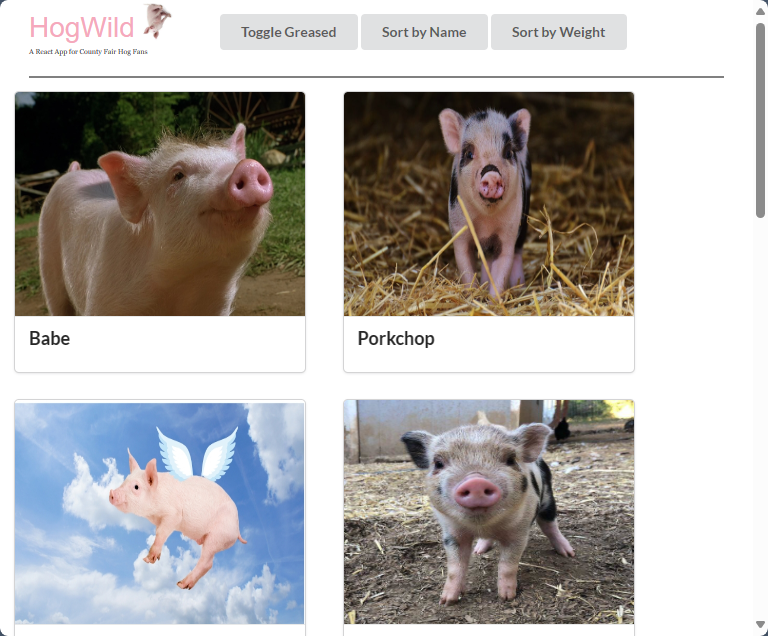

# Hog Wild React App

## Project Overview

Hog Wild is a React web application that allows users to explore information about different hogs. Users can view hog tiles, filter hogs based on various criteria, sort them by name or weight, and enjoy additional features like hiding hogs and adding new ones.

## Installation

1. Clone the repository: `git clone https://github.com/saonara/react-hooks-hogwild.git`
2. Navigate to the project directory: `cd react-hooks-hogwild`
3. Install dependencies: `npm install`
4. Start the development server: `npm start`

## Usage

1. Upon loading the app, hog tiles are displayed, showing the name and image of each hog.
2. Click on a hog tile to view additional details such as specialty, weight, greased status, and highest medal achieved.
3. Use the filter option to display only greased hogs.
4. Sort hogs by name or weight using the sorting feature.
5. Bonus features include the ability to hide hogs and add new hogs using a form.
6. Enjoy exploring the world of hogs!

## Implementation Details

- Built with React, utilizing hooks for state management and functional components.
- Followed React best practices for component structure, state management, and data flow.
- Implemented filtering and sorting functionalities using state and callback functions.

## Additional Features

- Added the ability to hide hogs from view without deleting them.
- Implemented a form for users to add new hogs to the page.
- Utilized Semantic Cards for enhanced visual presentation of hog details.

## Credits

- Semantic UI React library: https://react.semantic-ui.com/
- Hog data provided by Learn.co curriculum.

## Contributing

Feel free to submit issues, suggest improvements, or contribute to the project via pull requests.

## License

This project is licensed under the MIT License. See the [LICENSE](/LICENSE) file for details.
